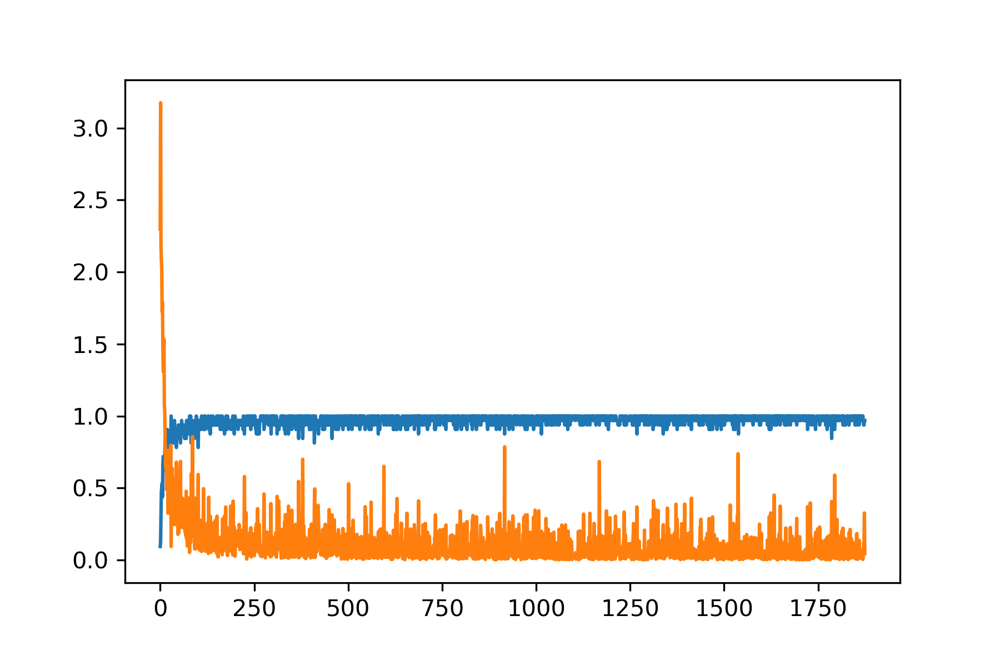
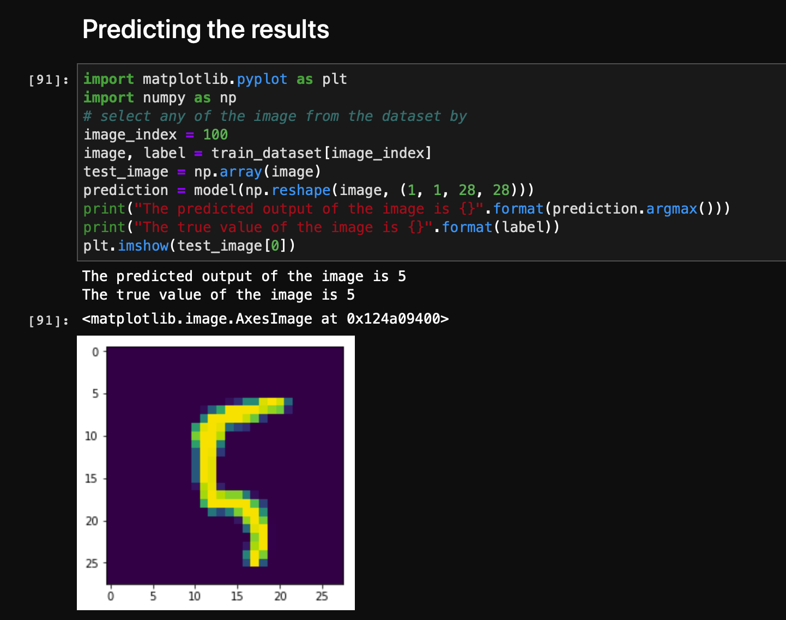

# Learning-Pytorch-CNN-MNIST

This project help to learn the use Pytorch framework to create a simple Convolutional Neura Network and train the machine learning model on the classical MNIST dataset to recognise the handwritten digits.

PyTorch is an open-source machine learning library for Python, based on Torch, used for applications such as natural language processing. It is primarily developed by Facebook's artificial-intelligence research group, and Uber's "Pyro" Probabilistic programming language software is built on it.

## Results after training

### Evaluating the prediction model

### Predicting the result with the handwritten image

## Resources

https://adventuresinmachinelearning.com/convolutional-neural-networks-tutorial-in-pytorch/
